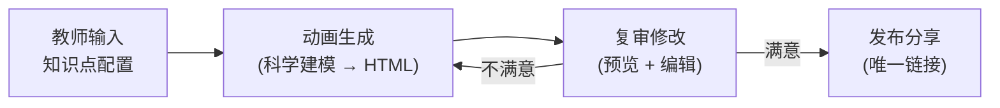

# 独立知识点动画生成项目 — 完整实施方案

## 项目概述

构建一个独立的 Web 应用，让教师可以输入知识点概念，自动生成交互式动画实验页面，支持预览、修改、重新生成，并通过唯一链接分享给学生。

---

## 技术栈

| 层 | 技术选型 | 理由 |
|---|---------|------|
| 框架 | **Next.js 15 + App Router** | SSR + API Routes 一体化，与原 OpenMAIC 技术栈一致 |
| 样式 | **Vanilla CSS** (含 CSS Variables) | 灵活，无额外依赖 |
| 持久化 | **SQLite** (`better-sqlite3`) | 零配置、文件级数据库，适合独立部署 |
| LLM | **DeepSeek** (`api.deepseek.com`) | 使用 `deepseek-chat` 模型，OpenAI 兼容接口 |
| 依赖 | `jsonrepair`, `nanoid` | 从 OpenMAIC 继承的最小依赖 |

---

## 核心用户流程



---

## 功能规格

### 1. 教师输入界面 (`/`)

教师填写以下字段即可触发生成：

| 字段 | 类型 | 必填 | 说明 |
|------|------|------|------|
| 概念名称 | 文本 | ✅ | 如"弹性计算"、"牛顿第二定律" |
| 学科 | 文本 | ❌ | 如"计算机科学"、"物理" |
| 概念概述 | 多行文本 | ✅ | 对概念的详细描述 |
| 核心要点 | 标签列表 | ❌ | 3-5 个关键知识点 |
| 交互设计思路 | 多行文本 | ❌ | 教师对交互方式的想法（留空则由 AI 自行设计） |
| 语言 | 下拉 | ✅ | 中文 / English |

### 2. 生成与进度 (`/generate/[id]`)

- 点击"生成动画"后显示进度条
- 阶段 1：科学建模（约 5s）→ 显示提取到的公式/约束
- 阶段 2：HTML 代码编写（约 15-30s）→ 完成后跳转预览

### 3. 复审修改界面 (`/review/[id]`)

核心功能：
- **左侧**：iframe 实时预览生成的动画
- **右侧面板 (自然语言修改)**：
  - 📋 当前科学模型摘要（供参考）
  - 💬 **对话修改区**：教师可直接输入自然语言指令，例如：“将服务器改成蓝色的圆柱体”、“当负载大于80%时背景变红”、“这里的扩容机制不符合真实情况，应该是先排队再扩容”。
  - 🔄 系统接收指令后，将之前的生成代码与修改意见结合，触发新一轮的 LLM 生成。
  - ✅ "发布"按钮

### 4. 分享页面 (`/share/[id]`)

- 无需登录即可访问的公开页面
- 全屏显示动画内容（iframe）
- 底部显示标题、学科、创建时间
- 支持复制分享链接

---

## 数据库设计

```sql
CREATE TABLE animations (
  id          TEXT PRIMARY KEY,         -- nanoid 生成
  title       TEXT NOT NULL,            -- 概念名称
  subject     TEXT,                     -- 学科
  overview    TEXT NOT NULL,            -- 概念概述
  key_points  TEXT,                     -- JSON: string[]
  design_idea TEXT,                     -- 交互设计思路
  language    TEXT DEFAULT 'zh-CN',
  
  -- 生成结果
  scientific_model TEXT,                -- JSON: ScientificModel
  html        TEXT,                     -- 生成的完整 HTML
  status      TEXT DEFAULT 'draft',     -- draft | generating | review | published
  
  -- 元数据
  created_at  TEXT DEFAULT (datetime('now')),
  updated_at  TEXT DEFAULT (datetime('now')),
  published_at TEXT
);
```

---

## 项目目录结构

```
E:\interactive-anim\
├── app/
│   ├── layout.tsx                  # 全局布局
│   ├── page.tsx                    # 教师输入界面 (首页)
│   ├── globals.css                 # 全局样式
│   ├── generate/[id]/
│   │   └── page.tsx                # 生成进度页
│   ├── review/[id]/
│   │   └── page.tsx                # 复审修改页
│   ├── share/[id]/
│   │   └── page.tsx                # 公开分享页
│   └── api/
│       ├── animations/
│       │   ├── route.ts            # POST 创建 / GET 列表
│       │   └── [id]/
│       │       ├── route.ts        # GET/PUT/DELETE 单条
│       │       └── publish/
│       │           └── route.ts    # POST 发布
│       └── generate/
│           └── route.ts            # POST 触发生成
├── lib/
│   ├── db.ts                       # SQLite 初始化 + 操作
│   ├── llm.ts                      # Ollama 调用封装
│   ├── generator/
│   │   ├── scientific-modeler.ts   # 阶段 1
│   │   ├── html-generator.ts       # 阶段 2
│   │   ├── post-processor.ts       # 阶段 3
│   │   └── json-repair.ts          # JSON 容错解析
│   └── prompts/
│       ├── loader.ts               # Prompt 加载器
│       └── templates/
│           ├── scientific-model/   # system.md + user.md
│           └── html-generation/    # system.md + user.md
├── package.json
└── next.config.ts
```

---

## API 设计

| 方法 | 路径 | 说明 |
|------|------|------|
| `POST` | `/api/animations` | 创建动画记录（保存输入配置） |
| `GET` | `/api/animations` | 获取所有动画列表 |
| `GET` | `/api/animations/[id]` | 获取单条动画详情 |
| `PUT` | `/api/animations/[id]` | 更新动画（修改 HTML / 输入） |
| `DELETE` | `/api/animations/[id]` | 删除动画 |
| `POST` | `/api/animations/[id]/publish` | 发布动画（状态 → published） |
| `POST` | `/api/generate` | 触发动画生成（返回生成结果） |

---

## 分步实施计划

### Step 1：项目初始化（~5 min）
- `npx create-next-app` 创建项目
- 安装依赖：`better-sqlite3`, `jsonrepair`, `nanoid`
- 初始化全局样式和布局

### Step 2：数据与 LLM 层（~10 min）
- 实现 `lib/db.ts`（SQLite 建表 + CRUD）
- 实现 `lib/llm.ts`（封装 Ollama fetch 调用）

### Step 3：生成管线（~15 min）
- 从 OpenMAIC 提取并适配：
  - `scientific-modeler.ts`
  - `html-generator.ts`
  - `post-processor.ts`（直接复制）
  - `json-repair.ts`（直接复制）
  - 4 个 `.md` Prompt 模板
- 实现 `/api/generate` 路由

### Step 4：教师输入界面（~10 min）
- 首页表单（概念名称、概述、要点等）
- 提交后创建记录并跳转生成页

### Step 5：生成进度页（~5 min）
- 轮询 or SSE 显示生成状态
- 完成后跳转复审页

### Step 6：复审修改界面（~20 min）
- 左侧 iframe 预览
- 右侧自然语言对话框 + 历史修改记录
- 对接 LLM 实现基于上下文的代码重构（Refine）
- 发布按钮

### Step 7：分享页面（~5 min）
- 公开访问的全屏 iframe 展示
- 标题信息 + 复制链接按钮

---

## 验证计划

### 自动化
- 验证 SQLite CRUD 操作
- 验证 Ollama 连接和响应

### 手动
- 端到端流程：输入"弹性计算" → 生成 → 复审 → 分享链接
- 浏览器中验证分享页面可独立访问

> [!IMPORTANT]
> **项目位置**：`E:\interactive-anim\`（独立于 OpenMAIC 项目）
> **端口**：开发时运行于 `3000`（避免与 OpenMAIC 的 `1972` 冲突）
> **LLM**：DeepSeek (`api.deepseek.com`, 模型 `deepseek-chat`)
